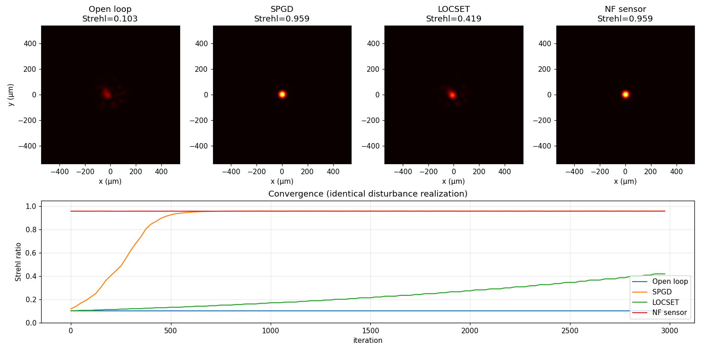

# cbc-sim

A modular, numpy-based simulator for tiled-aperture **coherent beam combining**
(CBC), built around an N-channel architecture with realistic per-channel
disturbances and three classical feedback control loops.



The figure above compares the same disturbance realisation (random initial
phases plus 20 μrad RMS tilt jitter) under four different feedback strategies:
open loop, SPGD, LOCSET, and a near-field interferogram phase sensor.

## Features

- **Source model** — wavelength, power, Lorentzian linewidth (Δν drives a
  Wiener-process phase noise on each channel), nominal polarization
- **Geometry generators** — hexagonal close-packed, square grid, and 1-D
  linear arrays, parameterised by the centre-to-centre pitch
- **Sub-aperture profiles** — Gaussian beam (focal waist `w_f = λf/(πw₀)`)
  or hard circular aperture (Airy / `jinc` focal envelope)
- **Per-channel disturbances** — initial Gaussian phase, polarization
  rotation (Jones rotation), beam tilt (with both correctable
  piston-coupling and uncorrectable envelope-shift loss)
- **Feedback controllers**
  - `OpenLoop` — baseline, no correction
  - `SPGD` — Stochastic Parallel Gradient Descent (two-sided dither)
  - `LOCSET` — multitone lock-in detection
  - `NearFieldPhaseSensor` — idealised direct phase measurement
- **Figures of merit** — Strehl ratio, power-in-bucket, residual phase RMS,
  geometric fill factor
- **Two interactive demos** — a matplotlib widget app (no extra dependencies)
  and a Streamlit web UI

## Installation

```bash
git clone <your-fork-url> cbc-sim
cd cbc-sim
pip install -e .
```

For the optional Streamlit web UI:

```bash
pip install -e ".[web]"
```

For the test suite:

```bash
pip install -e ".[test]"
pytest
```

## Quick start

```python
import numpy as np
from cbc.simulator import Simulator
from cbc.controllers import SPGD

rng = np.random.default_rng(42)
sim = Simulator(N=19, geometry_kind="hexagonal", rng=rng,
                controller=SPGD(rng=rng))
sim.randomize_disturbances(phase_sigma=np.pi, tilt_jitter_urad=20.0)

for _ in range(3000):
    sim.step()

print(f"Strehl: {sim.strehl():.3f}")
print(f"PIB(100 μm): {sim.power_in_bucket(100e-6) * 100:.1f}%")
print(f"Residual RMS: {sim.residual_rms():.3f} rad")
```

## Interactive demos

```bash
# Matplotlib widget app (works offline, no extra deps)
python apps/interactive_mpl.py

# Streamlit web UI
streamlit run apps/streamlit_app.py

# Static comparison plot (open loop vs all three controllers)
python examples/basic_demo.py
```

## Architecture

```
cbc/
├── source.py        Laser source — λ, power, linewidth, polarization
├── geometry.py      Array geometries (hex, square, linear) + fill factor
├── apertures.py     Sub-aperture profiles (Gaussian, hard circular)
├── channels.py      Per-channel state and disturbance models
├── propagation.py   Aperture → focal-plane Fraunhofer transform
├── controllers.py   Feedback algorithms (Off, SPGD, LOCSET, NF sensor)
├── metrics.py       Strehl, PIB, fill factor, phase RMS
└── simulator.py     Top-level orchestrator and time-stepping
```

Each module is independently testable and reusable — the `Simulator` is a
thin wrapper that wires the pieces together.

## Theory

### Forward model

For an array of N sub-apertures with centres `(x_n, y_n)`, complex
coefficients `c_n`, and a single-aperture amplitude profile `a(r)`, the
focal-plane field is

```
E(x_f, y_f) = ã(x_f, y_f) · Σ_n  c_n · exp(-i k (x_n x_f + y_n y_f) / f)
```

where `ã` is the Fourier transform of `a` and `k = 2π/λ`. The sum is the
**array factor** and `ã` is the **envelope**. The Jones-vector treatment
gives separate `E_x` and `E_y` components, summed incoherently for
intensity: `I = |E_x|² + |E_y|²`.

### Tilt model

A per-channel tilt α decomposes into

1. a **correctable** piston coupling `k · (x_n α_x + y_n α_y)` (absorbed
   into `c_n` and removable by feedback), and
2. an **uncorrectable** envelope shift, modelled here as a per-channel
   amplitude reduction
   `A_n = exp(-((α_n f)² ) / w_f²)`.

This second term sets the achievable Strehl ceiling even with perfect
phasing.

### Linewidth model

A Lorentzian linewidth Δν generates a Wiener phase walk on each channel
with per-step variance `2π · Δν · dt` (Schawlow–Townes-style noise).

### Strehl ratio

```
S = (|Σ c_x|² + |Σ c_y|²) / N²
```

normalised so that perfectly phased, perfectly aligned, co-polarised
channels give `S = 1`.

### Controllers

| Algorithm   | Sensor     | Scaling                  | Strengths                          |
|-------------|------------|--------------------------|-------------------------------------|
| SPGD        | bucket J   | ~N iterations to converge | sensor-free, robust                |
| LOCSET      | bucket J   | ~constant iterations      | parallel per-channel gradient      |
| NF sensor   | per-chan φ | ~constant iterations      | fastest; limited by sensor noise   |

## Extending

To add a new feedback algorithm, subclass `Controller`:

```python
from cbc.controllers import Controller

class MyController(Controller):
    name = "mine"

    def step(self, simulator):
        ch = simulator.channels
        # Inspect simulator.on_axis_intensity() or simulator.focal_intensity()
        # Modify ch.correction in place.
        ...
```

The simulator's `step()` calls `controller.step(self)` once per substep
after applying the linewidth-driven random walk.

## License

MIT
